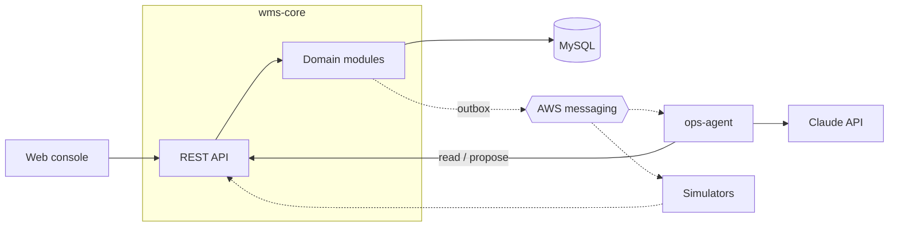

# Cloud-Based WMS with Integrated Agentic AI Workflows

A cloud-based warehouse management system with an AI operations agent built in. The WMS handles orders, waves, allocation, replenishment, and task execution. The agent investigates operational problems through the WMS API and proposes fixes, which a supervisor approves before they run.

Independent learning project, modeled on publicly documented WMS concepts. Not affiliated with any vendor.

**Status:** Phase 1 of 6. Inventory, orders, wave planning, task execution, the console, the agent and the demo scenario are built and run locally. Authentication and the AWS deployment are next; until then there is no public instance.

- [docs/PLAN.md](docs/PLAN.md) — the finished product and the phases to get there
- [docs/MVP_PLAN.md](docs/MVP_PLAN.md) — Phase 1, commit by commit
- [docs/DESIGN.md](docs/DESIGN.md) — the full design
- [docs/adr/](docs/adr/README.md) — decisions made along the way

## Architecture

Solid lines are built. Dashed lines are planned (see [PLAN.md](docs/PLAN.md)).



## Stack

| Component | Tech |
|---|---|
| wms-core | Java 21, Spring Boot, MySQL 8, Flyway |
| ops-agent | Python, FastAPI, Claude API |
| web | React, TypeScript, Vite |
| local | Docker Compose |
| cloud (Phase 1, in progress) | AWS: containers, RDS for MySQL, S3 + CloudFront, Terraform |

Not in scope: labor standards, billing, multi-warehouse, lots/serials, cartonization, carrier rating, returns.

## Run locally

Requires Docker, JDK 21, and Node 24.

```bash
docker compose -f deploy/compose/docker-compose.yml up -d --wait
```

```bash
cd wms-core && ./mvnw spring-boot:run -Dspring-boot.run.profiles=dev
```

The `dev` profile seeds a demo warehouse and a blocked wave on first start. API docs: http://localhost:8080/swagger-ui/index.html

```bash
cd web && npm install && npm run dev
```

Console: http://localhost:5173

The agent is optional; without it the console still shows the WMS's own diagnosis.

```bash
cd ops-agent && ANTHROPIC_API_KEY=... .venv/Scripts/python -m uvicorn ops_agent.api:app --app-dir src --port 8000
```
