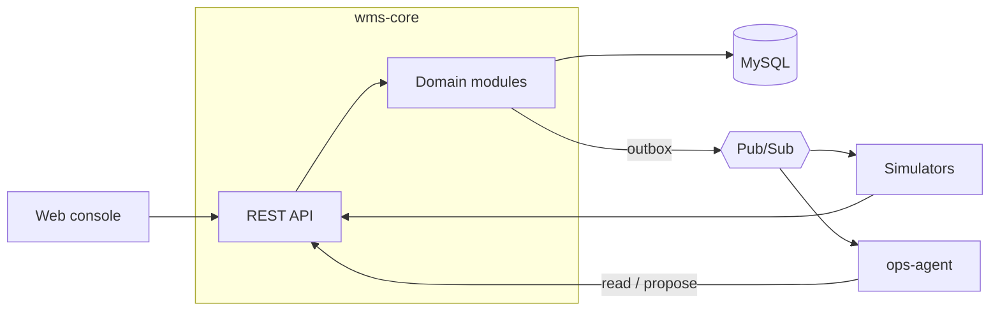

# Cloud-Based WMS with Integrated Agentic AI Workflows

A cloud-based warehouse management system with an AI operations agent built in. The WMS handles orders, waves, allocation, replenishment, and task execution. The agent investigates operational problems through the WMS API and proposes fixes, which a supervisor approves before they run.

Independent learning project, modeled on publicly documented WMS concepts. Not affiliated with any vendor.

**Status:** in design. See [docs/DESIGN.md](docs/DESIGN.md).

## Architecture

## Stack

| Component | Tech |
|---|---|
| wms-core | Java 21, Spring Boot, MySQL 8, Flyway |
| ops-agent | Python, FastAPI, Claude API |
| simulators | Python |
| web | React, TypeScript, Vite |
| infra | Docker Compose, Google Pub/Sub emulator, Keycloak, Kubernetes (kind) |
