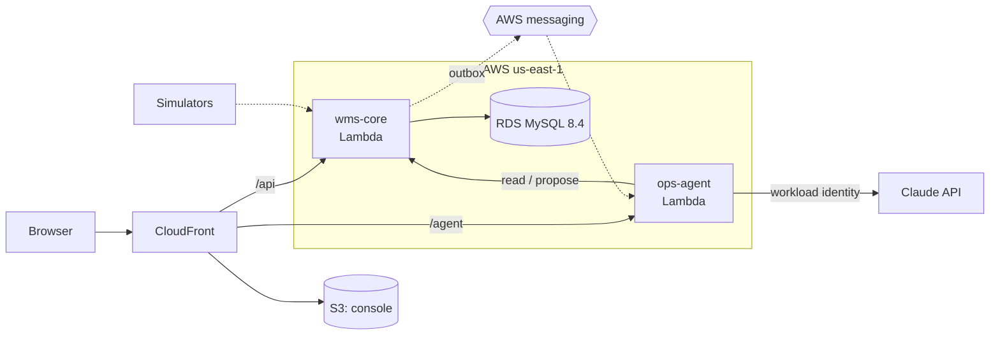

# Cloud-Based WMS with Integrated Agentic AI Workflows

A cloud-based warehouse management system with an AI operations agent built in. The WMS handles orders, waves, allocation, replenishment, and task execution. The agent investigates operational problems through the WMS API and proposes fixes, which a supervisor approves before they run.

Independent learning project, modeled on publicly documented WMS concepts. Not affiliated with any vendor.

**Live demo:** https://dana7rqasft6b.cloudfront.net — open a blocked wave, ask the agent why, and (with the supervisor passcode) approve its fix.

**Status:** Phase 1 of 6 complete: wave planning, task execution, a deterministic blocker diagnosis, the console, an agent that proposes fixes a supervisor approves, role-based auth, and the AWS deployment. Inbound (receiving, putaway) and outbound (pack, ship) come in Phase 2.

- [docs/PLAN.md](docs/PLAN.md) — the finished product and the phases to get there
- [docs/MVP_PLAN.md](docs/MVP_PLAN.md) — Phase 1, commit by commit
- [docs/DESIGN.md](docs/DESIGN.md) — the full design
- [docs/adr/](docs/adr/README.md) — decisions made along the way

## Architecture

Solid lines are built and deployed. Dashed lines are planned (see [PLAN.md](docs/PLAN.md)).



The agent can read and propose; only a supervisor can approve, and the server enforces it ([ADR 0027](docs/adr/0027-roles-for-public-agent-supervisor.md)). It reaches Claude through AWS workload identity federation, so no API key exists ([ADR 0028](docs/adr/0028-claude-via-workload-identity.md)).

## Stack

| Component | Tech |
|---|---|
| wms-core | Java 21, Spring Boot, MySQL 8, Flyway |
| ops-agent | Python, FastAPI, Claude API |
| web | React, TypeScript, Vite |
| local | Docker Compose |
| cloud | AWS: Lambda (container images), RDS for MySQL, S3 + CloudFront, Terraform, GitHub Actions via OIDC ([ADR 0029](docs/adr/0029-serverless-on-lambda.md), [deploy/terraform](deploy/terraform/README.md)) |

Not in scope: labor standards, billing, multi-warehouse, lots/serials, cartonization, carrier rating, returns.

## Run locally

Requires Docker, JDK 21, and Node 24.

```bash
docker compose -f deploy/compose/docker-compose.yml up -d --wait
```

```bash
cd wms-core && ./mvnw spring-boot:run -Dspring-boot.run.profiles=dev
```

The `dev` profile seeds a demo warehouse and a blocked wave on first start. API docs: http://localhost:8080/swagger-ui/index.html

```bash
cd web && npm install && npm run dev
```

Console: http://localhost:5173

The agent is optional; without it the console still shows the WMS's own diagnosis. Setup, including its
keyless access to Claude, is in [ops-agent/README.md](ops-agent/README.md).
