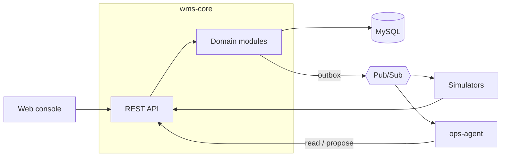

# Cloud-Based WMS with Integrated Agentic AI Workflows

A cloud-based warehouse management system with an AI operations agent built in. The WMS handles orders, waves, allocation, replenishment, and task execution. The agent investigates operational problems through the WMS API and proposes fixes, which a supervisor approves before they run.

Independent learning project, modeled on publicly documented WMS concepts. Not affiliated with any vendor.

**Status:** in development. Inventory core is built. The plan is in [docs/DESIGN.md](docs/DESIGN.md), and decisions made along the way are in [docs/adr/](docs/adr/README.md).

## Architecture



## Stack

| Component | Tech |
|---|---|
| wms-core | Java 21, Spring Boot, MySQL 8, Flyway |
| ops-agent | Python, FastAPI, Claude API |
| simulators | Python |
| web | React, TypeScript, Vite |
| infra | Docker Compose, Google Pub/Sub emulator, Keycloak, Kubernetes (kind) |

## Run locally

Requires Docker, JDK 21, and Node 24.

```bash
docker compose -f deploy/compose/docker-compose.yml up -d --wait
```

```bash
cd wms-core && ./mvnw spring-boot:run -Dspring-boot.run.profiles=dev
```

The `dev` profile seeds a demo warehouse on first start. API docs: http://localhost:8080/swagger-ui/index.html

```bash
cd web && npm install && npm run dev
```

Console: http://localhost:5173
