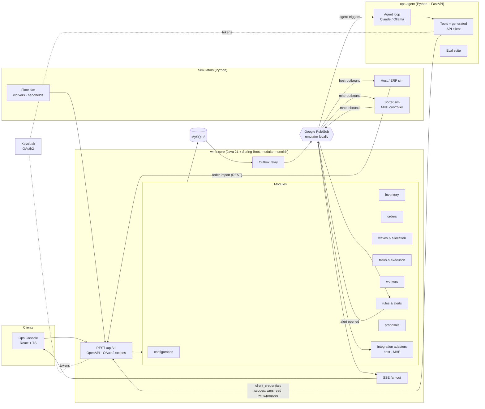
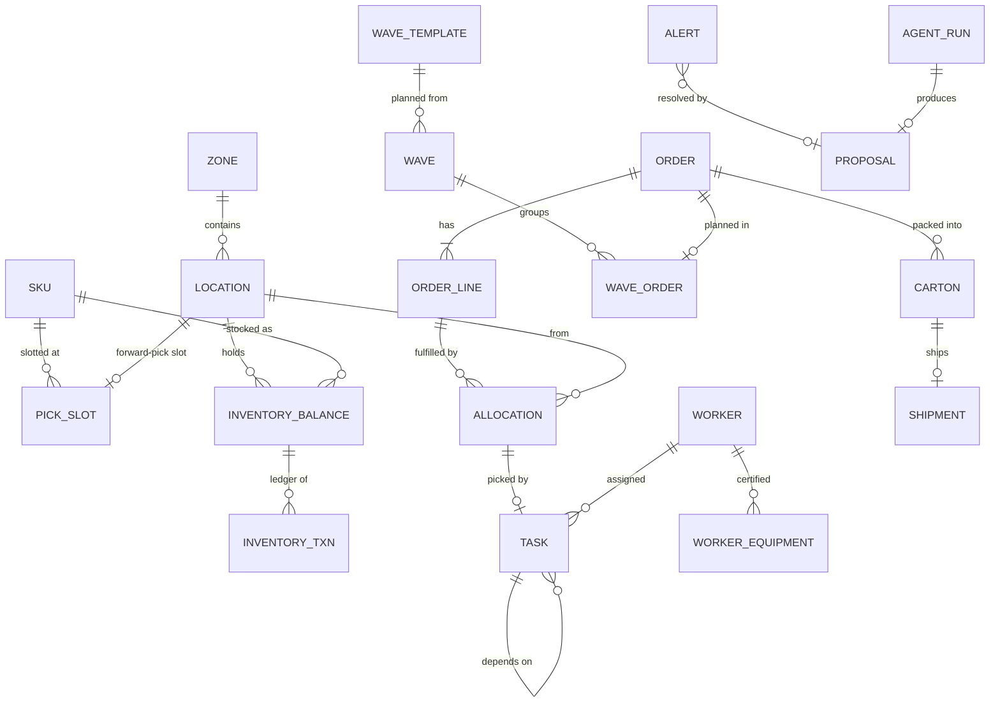

# Design: Cloud-Based WMS with Integrated Agentic AI Workflows

> An independently built cloud-based warehouse management system, inspired by publicly documented WMS concepts
> (waves, allocation, replenishment, task management) and by the public architecture and direction of
> enterprise WMS vendors such as Manhattan Associates (cloud-native microservices, API-first, event-driven,
> agents embedded in the operational layer). It contains no proprietary code, schemas, or documentation from
> any vendor, and it does not claim to reproduce any vendor's product.

Status: **Living design.** Implementation decisions, with code references, are recorded in
[`docs/adr/`](adr/README.md). This document is updated wherever the implementation departs from the plan.

Changes since v1: Java/Spring Boot core, Python agent, MySQL (not Postgres), Google Pub/Sub (emulator locally),
local-first on Docker and Kubernetes, configuration-driven rules, an automation (MHE) integration, a bidirectional
host interface, and a consultant-style solution design document. See §13 for the reasoning.

---

## 0. Critique of the original plan

The original concept is solid. Seven specific things would weaken it, and the design below changes them:

| # | Original idea | Problem | Change |
|---|---|---|---|
| 1 | Reserve inventory at order creation | Most WMSs *allocate* stock when a wave is planned or released, not when the order arrives. Allocating early locks stock against orders that won't ship for days. | Orders arrive as unallocated demand. **Allocation happens at wave planning.** |
| 2 | "Inventory" as a quantity per SKU | Warehouse problems happen at the *location* level: forward-pick vs. reserve, on-hand vs. allocated. A per-SKU number can't express "Wave 27 is blocked." | **Location-level balances** (`on_hand`, `allocated`) plus an **immutable inventory ledger**. |
| 3 | The agent creates replenishment when forward-pick runs out | This is a deterministic rule. Every real WMS does it without AI (demand replenishment). Using an LLM here is "AI for the sake of AI." | The **engine** creates demand replenishment. The **agent** handles what rules can't: stalled replenishment, trade-offs between at-risk orders, phantom inventory, and explaining root causes that span several entities. |
| 4 | `INVENTORY_LOW` and `WAVE_BLOCKED` as events | These are *derived conditions*, not facts. Treating them as events mixes "what happened" with "what we concluded." | **Domain events** are past-tense facts (`pick.confirmed`). A **rules layer** derives **alerts** (`WAVE_BLOCKED`) from those facts and de-duplicates them. |
| 5 | Many small `get_*` tools | Chaining 12 small getters makes the LLM do arithmetic and joins, which is where hallucinations and token cost come from. | Keep the getters, but add **deterministic diagnostic endpoints** (`/waves/{id}/diagnosis`) that do the computation. The LLM reasons over their structured output. |
| 6 | The user types "Execute" in chat | Free-text approval can't be audited, and state can change between recommendation and approval. | The agent emits a **typed Proposal**: commands, preconditions, and a dry-run impact. A human approves it in the UI, and execution re-checks the preconditions. |
| 7 | Everything as microservices | For one developer, fine-grained microservices mean operational overhead without the benefits. | **A small number of services split along real boundaries**: the WMS core (a modular monolith), the agent (a security boundary), and simulators (external systems). The core's modules are the seams where it would split further. |

---

## 1. Final scope

### The pitch in one sentence
A warehouse execution system with real allocation, wave, and task logic, configuration-driven rules, an
event-driven exception pipeline, and integrations with host (ERP) and automation (MHE) systems. On top of it
sits an operations agent that diagnoses problems through the same scoped APIs any other client uses. It
proposes typed actions, and a supervisor approves them before they run.

### In scope
- **Master data:** SKUs, zones, locations (reserve / forward-pick / staging / pack / dock), forward-pick slots with min/max.
- **Configuration (data, not code):** wave templates, allocation strategies, replenishment rules, task priority rules. Edited in an admin UI, versioned, audited.
- **Inventory:** location-level balances, an immutable ledger, allocation, adjustments, cycle counts.
- **Orders:** host import (idempotent), lines, priority, carrier cutoff, holds.
- **Wave planning:** template → selection → allocation → demand replenishment → pick task generation → release.
- **Tasks:** PICK, REPLENISH, COUNT. Task dependencies, priority, pull-based claiming.
- **Execution:** worker claims the next task, confirms a pick, reports a short pick, completes replenishment.
- **Pack & ship:** pack confirmation → carton inducted to a **sortation system** (MHE integration) → divert to a carrier lane → ship confirmation.
- **Workers:** role, equipment certifications, zone, status (available / busy / break / offline).
- **Integrations:**
  - *Host (ERP):* order import in, ship confirmations and inventory adjustments out, with retries and dead-lettering.
  - *Automation (MHE):* WMS ↔ sorter message exchange through an adapter (anti-corruption layer), including fault handling.
- **Events:** transactional outbox → Google Pub/Sub → idempotent subscribers, plus live push to the UI.
- **Rules & alerts:** `WAVE_BLOCKED`, `ORDER_AT_RISK`, `FORWARD_PICK_BELOW_MIN`, `REPLENISHMENT_STALLED`, `INVENTORY_DISCREPANCY`, `MHE_FAULT`.
- **Agent:** investigation tools, typed proposals, approval flow, autonomy policy, run traces, eval suite.
- **Ops console:** dashboard, waves, orders, tasks, inventory, configuration, event timeline, AI operations panel.
- **Simulators:** warehouse floor (workers), host/ERP, and sorter. Seeded, with an accelerated clock and fault injection.

### Out of scope (and the writeup should say so)
Labor standards/engineered labor, billing, multi-warehouse, lots/serials/expiry, cartonization, carrier rating,
yard management, returns, receiving/putaway (stretch). Listing what you cut, and why, is itself a signal of judgment.

### Stretch (only after the core demo is solid)
1. **MCP server** exposing the agent's scoped tools, so any MCP client can operate the warehouse with the same permissions.
2. **Order streaming / waveless release** as a second release mode next to waves. Manhattan publicly markets
   order streaming as an alternative to traditional waving. Research it before claiming anything specific.
3. Receiving + putaway (ASN → receipt → putaway task into reserve).
4. A warehouse map view (location grid heat-mapped by availability and task activity).
5. Stream events to BigQuery (free tier) for analytics.

---

## 2. Architecture

### 2.1 Relation to Manhattan's public stack

Manhattan's published architecture uses Java + Spring microservices in Docker on Google Kubernetes Engine,
Cloud SQL for MySQL, Google Pub/Sub for asynchronous messaging, BigQuery for analytics, and REST between
services (sources in §14). This project follows the same technology families. It runs locally, for free:

| Manhattan (public) | This project, local (free) | This project, cloud (optional) |
|---|---|---|
| Java + Spring microservices | Java 21 + Spring Boot | same |
| Docker images | Docker | Artifact Registry |
| Google Kubernetes Engine | Docker Compose, then **kind** (local Kubernetes) | GKE Autopilot ($300 trial) |
| Cloud SQL for MySQL | MySQL 8 container | Cloud SQL for MySQL |
| Google Pub/Sub | **Official Pub/Sub emulator** + real Google client libraries | Pub/Sub |
| Cloud Logging / Monitoring | OpenTelemetry → Grafana LGTM container | Cloud Logging / Monitoring |
| BigQuery | — | BigQuery free tier (stretch) |
| Identity & authorization service | Keycloak (OAuth2 / OIDC) container | same, or Identity Platform |

What stays deliberately different: Manhattan runs 250+ microservices built by large teams. One developer
doesn't gain anything from that granularity. §2.3 explains where this project draws its service boundaries.

### 2.2 Diagram



### 2.3 Service boundaries (and why these)

| Service | Language | Why it's a separate process |
|---|---|---|
| `wms-core` | Java / Spring Boot | The system of record. It is internally modular (each module owns its tables and exposes a service interface; ArchUnit tests enforce this), so a module could be extracted into its own microservice later. |
| `ops-agent` | Python / FastAPI | **Security boundary.** The agent has no database credentials. It is an OAuth client with read and propose scopes only. Python is also where AI tooling is strongest. |
| `simulators` | Python | They stand in for **external systems** (ERP, sorter PLC/controller, workers' handhelds), so they must sit outside the core and use only its public interfaces. That also makes them integration tests. |
| `web` | React / TS | UI. |

This is the same reasoning a microservices platform uses: split where ownership, security, or external-system
boundaries exist, not per database table.

### 2.4 Key decisions

**The agent is an API client, not a privileged insider.** It authenticates with OAuth2 client credentials
(Keycloak) and holds scopes `wms.read` and `wms.propose`. It **cannot execute**: `wms.execute` belongs to human
supervisors, and optionally to an explicit autonomy policy (§5.5).

**Contract-first across three languages.** `wms-core` generates its OpenAPI spec with springdoc, and the spec is
committed to `contracts/openapi.yaml`. From it, CI generates:
- a TypeScript client for `web` (openapi-typescript + openapi-fetch)
- Python/Pydantic models and client for `ops-agent` and the simulators (openapi-python-client)
Agent tool input schemas are derived from those same models, so the agent can't call an API that doesn't exist.
Event payloads have JSON Schemas in `contracts/events/`, and both producer and consumer tests validate against them.
CI fails if the committed spec drifts from the generated one.

**Logic kept separate from I/O.** Allocation planning, state transitions, risk projection, and blocker diagnosis
are plain Java classes with no Spring or database dependencies. Services load state, call them, and persist the
results in one transaction along with their outbox events. This keeps the interesting logic fast to unit test
and property test (seeded random sequences; see [ADR 0006](adr/0006-property-tests-without-a-library.md)).

**Configuration over code.** Warehouse behavior (which orders go in a wave, which locations to allocate from,
when to replenish) lives in versioned configuration records, not in code. This mirrors how a WMS is implemented
in practice: consultants configure rules, and extensions are for what configuration can't express.

### 2.5 Stack

| Layer | Choice | Why |
|---|---|---|
| Core service | **Java 21 + Spring Boot 4** (Maven) | Matches Manhattan's Java/Spring stack. Virtual threads mean plain blocking code with no async complexity |
| Persistence | **Spring `JdbcClient`** with explicit SQL, no ORM | Locking (`FOR UPDATE`, `SKIP LOCKED`), lock order, and every write are visible in the code; nothing is flushed or lazily loaded behind your back |
| Migrations | **Flyway** (plain `.sql`) | |
| Database | **MySQL 8** (InnoDB) | Same engine as Manhattan's Cloud SQL. Supports `SKIP LOCKED`, `JSON`, `CHECK` constraints |
| Messaging | **Google Pub/Sub** (emulator locally), `spring-cloud-gcp-starter-pubsub` in Java, `google-cloud-pubsub` in Python | Same client libraries against the emulator and real Pub/Sub |
| Auth | **Keycloak** + Spring Security OAuth2 Resource Server | Standard OAuth2/OIDC. A realm export is committed so setup is reproducible |
| API docs | springdoc-openapi → `contracts/openapi.yaml` | |
| Agent | **Python 3.12 + FastAPI + Anthropic SDK**, with the model provider switchable to **Ollama** | Free local models for development; `claude-sonnet-5` / `claude-haiku-4-5` for demos and evals |
| Simulators | Python 3.12 (generated client + Pub/Sub client) | |
| Frontend | React + TS + Vite, TanStack Query + TanStack Table, Tailwind + shadcn/ui | Dense, data-grid-heavy operations UI |
| Live updates | Server-Sent Events (Spring `SseEmitter`), fed by a Pub/Sub subscription | One-way push is enough |
| Observability | OpenTelemetry (Java agent + Python SDK) → `grafana/otel-lgtm` container | Traces follow a request from the API through the database and Pub/Sub to the agent |
| Tests | JUnit 5, **Testcontainers** (MySQL, Pub/Sub emulator), seeded property tests, ArchUnit (module boundaries), pytest | |
| Local runtime | Docker Compose → kind + Kustomize | |
| CI | GitHub Actions: build, tests, spec-drift check, client codegen, image builds | |

### 2.6 Repo layout

```
wms-core/            Java 21 + Spring Boot (Maven)
  src/main/java/.../
    configuration/  inventory/  orders/  waves/  tasks/  workers/
    alerts/  proposals/  integration/  events/  shared/
  src/main/resources/db/migration/     Flyway SQL
ops-agent/           Python + FastAPI: agent loop, tools, prompts, evals/
simulators/          Python: floor/, host/, sorter/, faults/  (one package, several entrypoints)
web/                 React + TS ops console
contracts/
  openapi.yaml       generated from wms-core, committed
  events/            JSON Schemas for event payloads
  pubsub/            topic and subscription definitions
deploy/
  compose/           docker-compose.yml (MySQL, Pub/Sub emulator, Keycloak, LGTM, services)
  k8s/               Kustomize base + overlays (kind, gke)
  keycloak/          realm export
docs/
  DESIGN.md          this document
  SOLUTION_DESIGN.md consultant-style solution design (§12)
  adr/               architecture decision records
```

---

## 3. Domain model

### 3.1 Entities



| Table | Key columns | Notes |
|---|---|---|
| `zone` | code, name | A grouping only. Forward-pick and reserve share aisle zones, so the type is per location ([ADR 0010](adr/0010-zones-and-location-types.md)) |
| `location` | code (`A-03-02-B`), zone_id, type (`FORWARD_PICK`/`RESERVE`/`STAGING`/`PACK`/`DOCK`), pick_sequence, capacity_units, required_equipment (nullable) | `pick_sequence` drives pick-path ordering. Reserve may require `REACH_TRUCK` |
| `sku` | code (`SKU-10001`), description, uom, velocity_class (A/B/C) | |
| `pick_slot` | sku_id, location_id, min_qty, max_qty | Forward-pick slotting and replenishment thresholds |
| `inventory_balance` | location_id, sku_id, on_hand, allocated, version | `CHECK (on_hand >= 0 AND allocated >= 0 AND allocated <= on_hand)`. `available = on_hand − allocated` |
| `inventory_txn` | type (`RECEIPT`,`PICK`,`MOVE`,`ADJUST`,`COUNT_VARIANCE`), sku_id, from_loc, to_loc, qty, reason, ref_type/ref_id, actor, occurred_at | **Append-only.** Balances are a projection kept in the same transaction. A reconciliation check asserts `Σ ledger == balance` |
| `orders` | external_ref (unique), priority, status, carrier, carrier_cutoff_at, hold_reason, version | `ORDER` is a reserved word in SQL, hence `orders`. `external_ref` makes host import idempotent |
| `order_line` | order_id, line_no, sku_id, qty_ordered, qty_allocated, qty_picked, qty_shipped, status | |
| `allocation` | order_line_id, location_id, sku_id, qty, wave_id, status (`ACTIVE`/`PICKED`/`CANCELLED`) | The link between demand and physical stock |
| `wave` | number, template_id, template_version, status, planned_at, released_at, version | Records which config version planned it |
| `wave_order` | wave_id, order_id | |
| `task` | type (`PICK`/`REPLENISH`/`COUNT`), status, priority, sku_id, from_location_id, to_location_id, qty, wave_id, allocation_id, depends_on_task_id, assigned_worker_id, required_equipment, zone_id, sequence, version | **A single task table.** `depends_on_task_id` is how "this pick waits on that replenishment" becomes structural data instead of a guess |
| `worker` / `worker_equipment` | name, role, home_zone_id, status, shift_end_at / worker_id, equipment | |
| `carton` / `shipment` | order_id, lpn, status (`PACKED`/`INDUCTED`/`DIVERTED`/`NO_READ`/`SHIPPED`), assigned_lane / carrier, tracking_no, shipped_at | Carton status is driven by MHE messages |
| **Configuration** | `wave_template`, `allocation_strategy`, `replenishment_rule`, `task_priority_rule`: each with id, version, status (`DRAFT`/`ACTIVE`/`RETIRED`), definition (JSON, validated against a JSON Schema), changed_by | Configuration changes emit events, and the timeline shows who changed what |
| `outbox_event` | id (BIGINT AUTO_INCREMENT), event_id (UUID), type, version, aggregate_type, aggregate_id, payload (JSON), actor_type (`human`/`agent`/`system`/`integration`), actor_id, on_behalf_of, correlation_id, causation_id, occurred_at, published_at | §6 |
| `consumer_receipt` | consumer, event_id, processed_at | PK (consumer, event_id) → idempotency |
| `integration_message` | direction, channel (`HOST`/`MHE`), external_id, payload, status (`RECEIVED`/`PROCESSED`/`FAILED`/`DEAD_LETTERED`), attempts, error | The consultant's best friend when an interface misbehaves |
| `alert` | type, severity, subject_type/subject_id, status (`OPEN`/`ACKED`/`RESOLVED`), fingerprint, `open_fingerprint` (generated column: fingerprint when OPEN, else NULL), details (JSON) | MySQL has no partial indexes. A unique index on `open_fingerprint` gives "one open alert per fingerprint" because MySQL unique indexes allow multiple NULLs |
| `proposal` | alert_id, agent_run_id, status, rationale, commands (JSON), preconditions (JSON), predicted_impact (JSON), decided_by, decided_at, execution_result | §5.4 |
| `agent_run` / `agent_step` | (owned by ops-agent, which has its own small store: SQLite locally) | The agent service owns its traces. The core stores only proposals |
| `idempotency_key` | (principal, idem_key), request_hash, response status/content type/location/body, created_at | Written in the same transaction as the command ([ADR 0007](adr/0007-idempotency-keys-in-the-command-transaction.md)) |

### 3.2 State machines

```
Order:  RECEIVED ⇄ ALLOCATED → RELEASED → PICKING → PICKED → PACKED → SHIPPED
        RECEIVED / ALLOCATED → CANCELLED
        on_hold is a separate flag (RECEIVED..PICKED); short allocation is derived from the lines
        (ADR 0011)

Wave:   PLANNED → RELEASED → IN_PROGRESS → COMPLETED;  PLANNED → CANCELLED

Task:   CREATED → WAITING (dependency not done) → READY → ASSIGNED → IN_PROGRESS → COMPLETED
                                                    ↑__________|  (unassign / reassign)
        non-terminal → CANCELLED;  PICK in progress → SHORT_PICKED (exception)

Carton: PACKED → INDUCTED → DIVERTED → SHIPPED;  INDUCTED → NO_READ → (re-induct) INDUCTED
```

Each transition is a method `transition(state, command) → Result(newState, events) | DomainError`. An invalid
transition returns `INVALID_STATE_TRANSITION`, never a silent no-op.

### 3.3 Core algorithms

**Wave planning and allocation:**
1. The **wave template** selects candidate orders (cutoff window, priority, carrier) up to caps (max orders / units / lines).
2. For each line, sorted by priority then cutoff, apply the configured **allocation strategy**. Strategies are
   location-type preference plus an ordering: `PICK_SEQUENCE`, `FEWEST_LOCATIONS`, or `CLEAR_SMALLEST_FIRST`.
   - Allocate from **forward-pick** locations with available stock.
   - If short: check **reserve**. If reserve can cover it, create a **demand REPLENISH task** (reserve →
     forward-pick, quantity from the **replenishment rule**, e.g. `max(shortfall, max_qty − projected)` capped by
     reserve), then allocate against the *incoming* forward-pick quantity. The resulting PICK task gets
     `depends_on_task_id = replen task`, status `WAITING`.
   - If reserve can't cover it either: the line is **short-allocated**, and `order.short_allocated` is recorded
     for the rules layer.
3. Generate PICK tasks ordered by `pick_sequence`, with priority from the **task priority rules**.
4. **Concurrency:** lock the affected `inventory_balance` rows with `SELECT … FOR UPDATE` **in deterministic
   order (location_id, sku_id)** to prevent deadlocks between two waves planning at once. `CHECK` constraints are
   the final backstop against over-allocation.

`POST /waves/plan` supports **preview mode**, which runs the whole plan and rolls it back. This makes the
config demo possible: switch the allocation strategy and compare the two previews.

**Task claiming** (pull-based, like a worker's handheld asking for the next job). MySQL can't `UPDATE` a table
with a subquery on the same table, so the claim is two statements in one transaction:
```sql
SELECT id FROM task
WHERE status = 'READY'
  AND (required_equipment IS NULL OR required_equipment IN (:workerEquipment))
ORDER BY priority DESC, (zone_id = :homeZone) DESC, sequence
LIMIT 1
FOR UPDATE SKIP LOCKED;

UPDATE task SET status = 'ASSIGNED', assigned_worker_id = :worker, version = version + 1
WHERE id = :id;
```
Fifty simulated workers claiming at the same time never get the same task. There's a test for exactly this.

**Short pick:** a picker reaches a location the system says holds 6 units and finds 2. The system records
`COUNT_VARIANCE`, adjusts on-hand, re-allocates the remainder (or triggers replenishment), creates a COUNT task,
and emits `pick.short_reported`. This drives the *inventory accuracy* KPI.

**Order-at-risk projection:** `projected_completion = now + remaining_work / effective_rate`, where the rate comes
from recent completions by eligible workers. An order is at risk when the projection passes
`carrier_cutoff_at − pack_ship_buffer`. It's deterministic and explainable, and the agent can cite it.

**Wave diagnosis** (`GET /waves/{id}/diagnosis`): returns structured blockers.
```json
{
  "wave": 27, "orders": 25, "picks": {"total": 183, "completed": 96, "ready": 60, "waiting": 27},
  "blockers": [{
    "kind": "WAITING_ON_REPLENISHMENT",
    "affected_picks": 27, "affected_orders": 9, "sku": "SKU-10035",
    "replen_task": {"id": "T-8812", "status": "READY", "age_min": 41,
                    "required_equipment": "REACH_TRUCK", "eligible_workers_available": 0},
    "root_cause": "NO_ELIGIBLE_WORKER_AVAILABLE"
  }],
  "at_risk_orders": [{"order": "SO-10442", "cutoff": "15:00", "projected": "15:40"}]
}
```
The engine does the joins and arithmetic. The agent's job is to explain the result and decide what to do about it.

---

## 4. API design

**Conventions**
- Base path `/api/v1`. Resource-oriented reads; commands are `POST` to action sub-resources (`/waves/{id}/release`).
- **`Idempotency-Key`** header required on every `POST` command, recorded in the command's own transaction. The same
  key and request replays the stored response (`Idempotent-Replayed: true`). The same key with a different request
  returns `422 IDEMPOTENCY_KEY_REUSED`. A failed request doesn't consume its key ([ADR 0007](adr/0007-idempotency-keys-in-the-command-transaction.md)).
- **Resources are addressed by business code** (`/skus/SKU-10001`, `"location": "A-01-01-A"`); internal IDs stay
  internal ([ADR 0008](adr/0008-api-conventions.md)).
- **Optimistic concurrency** (planned, not yet built): resources carry `version`. Commands will accept
  `If-Match: <version>`, and a mismatch returns `409 VERSION_CONFLICT`.
- **Errors:** RFC 9457 `application/problem+json` (Spring's `ProblemDetail`) with stable domain codes:
  `INSUFFICIENT_INVENTORY`, `INVALID_STATE_TRANSITION`, `VERSION_CONFLICT`, `PRECONDITION_FAILED`,
  `NOT_ELIGIBLE`, `INVALID_CONFIGURATION`.
- **Keyset (cursor) pagination:** `?cursor=&limit=` returns `{items, nextCursor}`, with filtering (`?status=RELEASED&zone=A`).
- **Auth:** OAuth2 via Keycloak. Clients: `web` (authorization code + PKCE), `ops-agent`, `host-sim`,
  `floor-sim` (client credentials). Scopes: `wms.read`, `wms.operate`, `wms.plan`, `wms.configure`,
  `wms.propose`, `wms.execute`, `wms.integrate`.
- Every mutation writes an outbox event recording **actor type and id**, so the audit trail distinguishes human,
  agent, system, and integration actions.

**Endpoints (core)**

| Area | Endpoint | Scope |
|---|---|---|
| Host integration | `POST /integrations/host/orders` (batch, per-order result, idempotent on `external_ref`) · `GET /integrations/messages?status=FAILED` · `POST /integrations/messages/{id}/retry` | integrate / read / execute |
| Configuration | `GET/POST /config/{kind}` (`wave-templates`, `allocation-strategies`, `replenishment-rules`, `task-priority-rules`) · `POST /config/{kind}/{id}/activate` | read / configure |
| Orders | `GET /orders`, `GET /orders/{id}` · `POST /orders/{id}/hold` · `/release-hold` · `/prioritize` | read / execute |
| Inventory | `GET /inventory?sku=&location=&type=` · `GET /skus/{id}/availability` · `POST /inventory/adjustments` | read / execute |
| Locations | `GET /locations/{id}` (balances, slot, open tasks) | read |
| Waves | `POST /waves/plan?preview=true` · `GET /waves/{id}` · `GET /waves/{id}/diagnosis` · `POST /waves/{id}/release` · `/cancel` | plan / read / execute |
| Tasks | `GET /tasks?wave=&status=&type=` · `POST /tasks/{id}/reassign` · `/reprioritize` · `/cancel` · `POST /replenishments` · `POST /cycle-counts` | read / execute |
| Execution | `POST /workers/{id}/next-task` · `POST /tasks/{id}/start` · `/confirm-pick` · `/report-short` · `/complete` · `POST /orders/{id}/pack` | operate |
| Workers | `GET /workers?status=&equipment=` · `PATCH /workers/{id}/status` | read / operate |
| Alerts | `GET /alerts?status=OPEN` · `POST /alerts/{id}/ack` | read / operate |
| Proposals | `GET /proposals/{id}` · `POST /proposals` · `POST /proposals/{id}/approve` · `/reject` | propose / execute |
| Events | `GET /events?aggregate=&id=` (entity timeline) · `GET /stream` (SSE) | read |
| Metrics | `GET /metrics/operations` (dashboard KPIs) | read |

The agent exposes its own small API: `POST /investigations` (ask a question) and `GET /runs/{id}` (trace).

---

## 5. Agent and tool architecture

### 5.1 Two kinds of agent
| | Generic computer-use agent | Embedded operational agent (this project) |
|---|---|---|
| Path | LLM → screen/browser → any app | LLM → typed business APIs → domain commands |
| Permissions | Whatever the logged-in user can click | Explicit OAuth scopes; cannot execute |
| Reliability | Fragile to UI changes; reasons from pixels | Structured data, schema-validated calls |
| Verification | Hard | Every claim traceable to a tool result; every action re-validated |
| Strength | Breadth: works across tools that have no API | Depth: correct, auditable actions in one domain |

The MCP stretch goal connects the two: it exposes the operational agent's scoped tools to any general agent.

### 5.2 Division of labor
**Deterministic engine:** allocation, demand replenishment, task dependencies, risk projection, blocker
diagnosis, alert rules, MHE fault routing.
**Agent:** interpreting multi-cause situations, choosing between trade-offs (whose order waits?), spotting
patterns across entities (repeated short picks at one location, recurring sorter no-reads for one carrier),
and explaining everything in operator language.
**Human:** approves any state change, unless policy explicitly delegates that class of action (§5.5).

### 5.3 Tools
Each tool is a thin Python wrapper over the generated API client. Input schemas come from the generated Pydantic models.

*Investigation (scope `wms.read`):*
`diagnose_wave(wave_id)`, `get_wave`, `list_orders_at_risk(window)`, `get_order`, `get_sku_availability(sku)`,
`get_location`, `list_tasks(filter)`, `list_workers(filter)`, `get_event_history(aggregate, id)` (the timeline,
for "what changed?"), `list_open_alerts`, `list_failed_integration_messages`, `get_active_config(kind)`.

*Proposal (scope `wms.propose`):* **a single write tool**, `propose_actions`, whose input is a list of typed commands:
`create_replenishment`, `reassign_task`, `reprioritize_task`, `release_wave`, `hold_order`, `prioritize_order`,
`request_cycle_count`, `cancel_task`, `retry_integration_message`, plus a rationale and a list of evidence references.

Why one write tool: the agent can't execute anything, so every write is a *proposal*. Bundling commands lets a
proposal be an atomic plan that is approved or rejected as a unit.

### 5.4 Proposal lifecycle (human in the loop)
```
agent calls propose_actions → POST /proposals
  → core validates commands against schemas and scopes
  → core attaches preconditions automatically (entity versions, e.g. task T-8812@v7, sku availability ≥ 42)
  → core DRY-RUNS: executes the commands in a transaction, re-runs the wave diagnosis, captures the diff, ROLLBACK
      predicted_impact: { wave_27.waiting_picks: 27 → 0, at_risk_orders: 3 → 1 }
  → proposal PENDING, shown in the AI Ops panel with its evidence and predicted impact
supervisor approves
  → preconditions re-checked; any drift → STALE (the agent may re-plan), otherwise
  → commands executed through the SAME command handlers as a human, in one transaction
  → events recorded with actor=human:<supervisor>, on_behalf_of=agent_run:<id>
  → proposal EXECUTED → alert auto-resolves when its rule no longer fires
```
The dry-run is the most distinctive technical point here. The system *proves* what a proposal will do before
anyone approves it, using the real domain logic, with no separate simulation to drift out of sync.
In Spring, this is a programmatic `TransactionTemplate` that marks itself rollback-only. Outbox rows written
during the dry-run roll back with everything else, so a dry-run never publishes events.

### 5.5 Autonomy policy
Configurable per action type: `SUGGEST_ONLY` | `REQUIRE_APPROVAL` (default) | `AUTO_EXECUTE_WITH_NOTIFY`.
For example, `request_cycle_count` could be auto-executed; `hold_order` always requires approval. Auto-execute
requires that the dry-run shows a strictly positive impact and no new blockers.

### 5.6 Grounding and guardrails
- The final answer is structured output: `{summary, findings: [{claim, evidence: [tool_call_id]}], proposal_id?}`.
  The UI renders each finding with links to the evidence. A finding without evidence is rejected, and the run is retried once.
- Limits on steps (~12 tool calls), tokens, and commands per proposal (≤ 5). Scope checks happen at the API, not in the prompt.
- The system prompt holds a domain glossary and SOPs. Business policy lives in the prompt; enforcement lives in the API.
- "I don't have enough information" is an allowed and tested outcome.

### 5.7 Model providers
A small provider interface with two implementations:
- **Ollama** (local, free) for development of the loop and tools.
- **Anthropic API**: `claude-sonnet-5` for investigations, `claude-haiku-4-5` for triage and most eval runs.
Switched by configuration. The eval suite reports results per provider and model.

### 5.8 Triggers
1. **User-initiated:** "Why is Wave 27 delayed?" → `POST /investigations`.
2. **Event-initiated:** a rule opens an alert → the policy says `investigate` → the core publishes to the
   `agent-triggers` topic (debounced per fingerprint, with a daily token budget) → the agent investigates and
   attaches its result to the alert. Most events **never** reach the LLM. Rules filter them first.

### 5.9 Evals: the WMS grades the agent
`ops-agent/evals/scenarios/`. Each scenario defines seed state, an injected fault (using the simulators' fault
injectors), the expected root-cause category, and a success condition.

| Scenario | Fault | Correct behavior |
|---|---|---|
| S1 forward-pick depleted | Demand replen needed, reserve available | Explain; confirm replen exists; no unnecessary actions |
| S2 stalled replenishment | Replen READY 40 min; only reach-truck-certified worker is busy on low-priority work | Reassign / reprioritize |
| S3 true shortage | Reserve also insufficient; 3 orders compete; cutoffs differ | Prioritize by cutoff/priority; hold the rest; explain the trade-off |
| S4 phantom inventory | Repeated short picks at one location | Request cycle count; flag location |
| S5 zone imbalance | 20 ready tasks in zone C, idle workers in zone A | Reassign |
| S6 red herring | Wave "late" only because it was never released; not at risk | Say so; minimal or no action |
| S7 stale proposal | State changes between propose and approve | Proposal goes STALE; agent re-plans |
| S8 interface failure | Host rejects ship confirmations for one carrier code | Identify the failing messages and cause; propose retry after fix; don't touch operations |

**Automated grading, with no LLM judge:** apply the proposal in dry-run and re-run the diagnosis. The target
blocker has to disappear with no new ones introduced. Root-cause category is an exact match. The runner reports
pass rate, tokens, cost, and latency per model.

---

## 6. Event architecture

### 6.1 Transactional outbox → Pub/Sub
Every command writes its state change **and** its events in the **same MySQL transaction**. That avoids the
dual-write problem: you never commit state and then crash before publishing, or publish an event for state that
rolled back.

```
command handler ── BEGIN ── update state ── INSERT outbox_event(s) ── COMMIT
outbox relay (polls every ~200 ms; several replicas are safe):
   BEGIN
   SELECT … FROM outbox_event WHERE published_at IS NULL
   ORDER BY id LIMIT 100 FOR UPDATE SKIP LOCKED
   → publish each to its Pub/Sub topic (ordering key = aggregate id), wait for acks
   → UPDATE … SET published_at = now()
   COMMIT
subscribers (Pub/Sub subscriptions):
   → INSERT consumer_receipt (consumer, event_id); duplicate key → already processed, ack and skip
   → handle → ack
```
- **Delivery is at-least-once; consumers are idempotent.** Pub/Sub can redeliver, and the relay can publish twice
  if it crashes between publish and commit. `consumer_receipt` absorbs both.
- **A known gotcha, documented in an ADR:** an `AUTO_INCREMENT` value is assigned at insert, not at commit, so a
  reader that tracks a high-water id can skip an event whose transaction commits late. The relay claims
  unpublished rows instead of tracking an offset for that reason.
- **Ordering:** Pub/Sub ordering keys per aggregate keep one order's or wave's events in sequence. Consumers
  re-read current state, so they don't depend on global ordering.
- **Dead-lettering:** each subscription has a dead-letter topic after N attempts. Dead-lettered messages surface
  in the UI's integration monitor.
- **Events are versioned** (`type` + `version`), with JSON Schemas in `contracts/events/`.

### 6.2 Topics
| Topic | Producers | Subscribers |
|---|---|---|
| `wms-domain-events` | outbox relay | rules, task-dependencies, metrics projection, SSE fan-out |
| `host-outbound` | outbox relay (ship confirmations, adjustments) | host sim |
| `mhe-outbound` | outbox relay (sort instructions) | sorter sim |
| `mhe-inbound` | sorter sim (induct, divert, no-read, fault) | core MHE adapter |
| `agent-triggers` | outbox relay (alerts selected by policy) | ops-agent |

### 6.3 Event catalog (facts, past tense)
`order.received`, `order.held`, `order.hold_released`, `order.prioritized`, `wave.planned`, `wave.released`,
`wave.completed`, `order.allocated`, `order.short_allocated`, `task.created`, `task.ready`, `task.assigned`,
`task.reassigned`, `task.started`, `pick.confirmed`, `pick.short_reported`, `replenishment.completed`,
`inventory.adjusted`, `count.completed`, `order.packed`, `carton.inducted`, `carton.diverted`,
`carton.no_read`, `order.shipped`, `worker.status_changed`, `config.activated`, `integration.message_failed`,
`proposal.created`, `proposal.approved`, `proposal.executed`, `proposal.stale`, `alert.opened`, `alert.resolved`.

### 6.4 Consumers
| Consumer | Listens to | Does |
|---|---|---|
| `task-dependencies` | `replenishment.completed` | WAITING picks → READY |
| `rules` | inventory, task, wave, carton, and integration events, plus a 1-minute tick | Evaluates rules → opens/resolves alerts (fingerprint de-dupe) |
| `metrics-projection` | most events | Maintains dashboard KPIs in a read table (a simple read model) |
| `sse-fanout` | all | Pushes `{type, aggregate, id}` to connected consoles → TanStack Query refetches |
| `mhe-adapter` | `mhe-inbound` | Translates the sorter's message format into domain commands (anti-corruption layer) |

### 6.5 Derived alerts (rules)
| Alert | Condition |
|---|---|
| `FORWARD_PICK_BELOW_MIN` | Slot on-hand < min and no open replen for it |
| `REPLENISHMENT_STALLED` | Replen READY > N min, or no eligible worker available |
| `WAVE_BLOCKED` | Released wave has WAITING picks whose dependency is stalled, or zero READY picks while incomplete |
| `ORDER_AT_RISK` | Projected completion > cutoff − buffer |
| `INVENTORY_DISCREPANCY` | ≥ 2 short picks at one location within a window |
| `MHE_FAULT` | Sorter fault, or no-read rate above threshold |
| `INTERFACE_FAILURE` | Host messages failing or dead-lettered |

---

## 7. Integrations

### 7.1 Host (ERP) interface
- **Inbound:** `POST /integrations/host/orders` accepts a batch and returns a result per order
  (`ACCEPTED` / `DUPLICATE` / `REJECTED` with reasons). It is idempotent on `external_ref`, and every message is
  stored in `integration_message`.
- **Outbound:** ship confirmations and inventory adjustments are published to `host-outbound`. The host sim
  acknowledges them, and rejects some deliberately (for example, an unknown carrier code) to exercise retries,
  dead-lettering, and the integration monitor UI.

### 7.2 Automation (MHE) interface: sortation
The flow a consultant would configure and test:
```
order packed → carton LPN created → sort instruction {lpn, lane} published to mhe-outbound
sorter sim → carton.inducted → carton.diverted {lane}      → order ready to ship
           → carton.no_read (scanner missed the label)      → recirculate / exception lane, alert when rate > threshold
           → sorter.fault {jam, zone}                        → MHE_FAULT alert
```
The sorter sim speaks its **own invented message format** (as a real vendor would). The core's `mhe-adapter`
translates it into domain commands. That anti-corruption layer is the pattern that lets a WMS support many
automation vendors without leaking each vendor's protocol into the domain.

---

## 8. Frontend: the ops console
Aim for the look of an operations tool: dense, keyboard-friendly, and data-first. Neutral palette, status
colors used sparingly, monospace entity IDs, a live-updating event ticker.

- **Dashboard:** KPIs (open orders, at risk, open tasks by type, inventory accuracy, active workers,
  waves active/blocked, units/hr, sorter throughput), open alerts, and the **AI Operations panel**
  (alert → diagnosis → proposal card with predicted impact → View / Approve / Reject).
- **Waves:** list → detail (progress by task state, blockers from the diagnosis, orders, tasks). Plan with preview.
- **Orders**, **Tasks**, **Inventory** (by SKU and by location), **Workers**: TanStack Table grids with filters.
- **Configuration:** edit wave templates, allocation strategies, replenishment and priority rules; draft →
  activate, with version history.
- **Integration monitor:** host and MHE messages, failures, dead letters, retry.
- **Entity timeline:** the event history for any order, wave, task, or location, with the actor shown.
- **Agent run trace:** each tool call with input/output, tokens, and latency.
- **Ask box:** free-form questions, with answers rendered as findings plus evidence links.
- **Sim control (dev):** clock speed, order rate, fault injection.

---

## 9. Simulators
Python processes that act as the warehouse floor, the host, and the sorter, **only through public interfaces**
(REST and Pub/Sub). This means they double as integration tests.
- **Seed:** ~6 zones, ~1,200 locations, ~400 SKUs, velocity-skewed stock, default configuration.
- **Host sim:** imports orders on a daily curve (morning spike, cutoff surges); consumes `host-outbound`; rejects a configurable fraction.
- **Floor sim:** ~40 workers claim tasks, take time proportional to travel (pick-sequence distance), take breaks, end shifts.
- **Sorter sim:** consumes sort instructions, emits induct/divert, and injects a configurable no-read rate and faults.
- Seeded randomness plus an accelerated clock (e.g. 20×), so a demo reproduces exactly.
- **Fault injection CLI:** `deplete-forward <sku>`, `phantom-inventory <location>`, `worker-offline <equipment>`,
  `order-surge <n>`, `sorter-jam <zone>`, `host-reject <carrier>`. The eval scenarios reuse these.

---

## 10. Milestones
Build the domain before the AI. An agent is only as good as the system underneath it, and a working WMS
without AI already makes a strong portfolio piece.

| # | Milestone | Done when | Rough size |
|---|---|---|---|
| M0 | Foundations | GitHub repo + CI; Docker Compose (MySQL, Pub/Sub emulator, Keycloak, LGTM); Spring Boot skeleton with Flyway, ProblemDetail errors, OpenAPI export, OAuth resource server; empty FastAPI and React apps using the generated clients | 4–5 days |
| M1 | Inventory core | Locations, SKUs, slots, balances + ledger, adjustments; **property test** (random operation sequences never break invariants; ledger == balances); ArchUnit module rules | 1 wk |
| — | **Spring checkpoint** | If Spring is still slowing you down more than the domain work is, move the core to Python/FastAPI. The design is language-independent | — |
| M2 | Config + orders + wave planning | Configuration records with JSON Schema validation; host import (idempotent); allocation strategies; demand replenishment; task generation with dependencies; plan preview; **concurrent-wave allocation test** | 1.5 wks |
| M3 | Execution + floor/host sims | next-task (SKIP LOCKED) + **50-worker race test**; confirm/short pick; replen completion; pack; floor and host sims running a full day | 1.5 wks |
| M4 | Events + rules | Outbox relay → Pub/Sub; subscribers with receipts; dead letters; alerts with de-dupe; metrics projection; SSE; entity timeline | 1 wk |
| M5 | Integrations | Host outbound + failures + integration monitor; sorter sim + MHE adapter + no-read/fault handling | 1 wk |
| M6 | Ops console | Dashboard, waves, orders, tasks, inventory, configuration, integration monitor, timeline, live updates | 1.5 wks |
| **Checkpoint** | **Working WMS, no AI** | The sims produce a blocked wave, an MHE fault, and an interface failure, and a human can resolve each in the UI | — |
| M7 | Agent v1 | FastAPI service, client-credentials auth, read tools, Ollama + Anthropic providers, grounded answers, run traces, Ask box | 1 wk |
| M8 | Proposals + HITL | `propose_actions`, preconditions, **dry-run impact**, approve/reject/stale, AI Ops panel | 1 wk |
| M9 | Event-driven agent + evals | Alert-triggered investigations, autonomy policy, budget/debounce, eval suite S1–S8 with a results table | 1 wk |
| M10 | Kubernetes + ship it | Kustomize manifests on kind; optional short GKE deployment on the trial credit; architecture diagram, technical writeup, solution design doc, 3-minute demo video | 1 wk |

About 12–13 weeks at a steady pace, somewhat more than the TypeScript plan because of the Spring ramp-up and the
integration work. If time is short, the minimum impressive cut is **M0–M4, M6 (basic), M7–M8**. After that, add
M5 integrations (strong signal for a consultancy), then evals and Kubernetes.

---

## 11. What makes this more than CRUD + LLM
1. **Real concurrency engineering.** Deadlock-free ordered locking for allocation, `SKIP LOCKED` task claiming,
   database-level invariants, and tests that prove all three under contention.
2. **Ledger-based inventory** with a reconciliation invariant and property-based tests.
3. **Transactional outbox → Pub/Sub** with idempotent consumers, dead-lettering, and a documented handling of the
   commit-order gotcha.
4. **Domain modeling.** Explicit state machines, task dependencies as data, allocation vs. on-hand, forward vs.
   reserve, facts vs. derived conditions.
5. **Configuration-driven behavior.** The same engine behaves differently per warehouse through versioned rules,
   the way a WMS is actually implemented.
6. **Integration architecture.** An idempotent host interface in both directions, and an MHE adapter as an
   anti-corruption layer, with failure handling and a monitor.
7. **Deliberate division of labor between rules and AI.**
8. **The agent as a least-privilege API client** with OAuth scopes. It can't execute, and every claim is tied to evidence.
9. **Dry-run proposals.** Predicted impact is computed by the real domain logic in a rolled-back transaction,
   then re-validated against preconditions at approval.
10. **Objective agent evals** graded by the system itself, reported per model with cost and latency.
11. **Contract-first across Java, Python, and TypeScript** from one OpenAPI spec, with drift checks in CI.
12. **Same technology families as Manhattan's published platform** (Java/Spring, MySQL, Pub/Sub, Kubernetes), run locally for free.

---

## 12. Deliverables
1. The working system, runnable with one `docker compose up`.
2. GitHub repository with CI.
3. Optional live deployment (GKE on trial credit, or a free-tier alternative).
4. Architecture diagram.
5. **Technical writeup:** architecture, key decisions (linking ADRs), the eval results table, and what I'd do differently.
6. **Solution design document** (`docs/SOLUTION_DESIGN.md`), written as a consultant would for a client:
   business requirements → process flows (order-to-ship, replenishment, exceptions) → configuration decisions
   (wave templates, allocation strategy, replenishment rules) and why → interface specifications (host, MHE) →
   test scenarios → cutover and rollback considerations. This shows the non-code half of the job.
7. **Demo video (~3 minutes)**:
   1. Dashboard live, sims at 20×. Point out the KPIs and the event ticker.
   2. Inject `worker-offline REACH_TRUCK` + `deplete-forward SKU-10035`. Wave 27 goes **BLOCKED**, and ORDER_AT_RISK fires.
   3. The AI Ops panel fills in automatically. Each claim in the agent's diagnosis links to evidence.
   4. Open the proposal: reassign T-8812, raise its priority, push back the low-priority task. Predicted impact:
      waiting picks 27 → 0, at-risk orders 3 → 0.
   5. Approve. The replenishment completes, picks turn READY, the wave unblocks, and the alert auto-resolves.
      Open the wave's timeline: actor = supervisor on behalf of the agent run.
   6. Briefly: change the allocation strategy in configuration and compare wave previews; show the integration monitor.
   7. Close on the agent trace and the eval results table.

---

## 13. Decision log (summary; implementation decisions are in [`docs/adr/`](adr/README.md))
| Decision | Choice | Reason |
|---|---|---|
| Core language | Java 21 + Spring Boot | Same stack as Manhattan's published platform. Demonstrates learning an unfamiliar enterprise stack. Checkpoint after M1 to fall back to Python if needed |
| Agent language | Python | Existing strength; strongest AI tooling; enforces the API-only boundary |
| Database | MySQL 8 | Manhattan's published choice (Cloud SQL for MySQL); familiar; has `SKIP LOCKED`, `JSON`, `CHECK` |
| Messaging | Google Pub/Sub (emulator locally) | Manhattan's published choice; free locally; same client code as production |
| Runtime | Docker Compose → kind → optional GKE | Free; the same images and manifests would run on GKE |
| Persistence | `JdbcClient`, explicit SQL | Concurrency-heavy domain: row locks and lock ordering must be visible and reviewable. JPA considered and not used ([ADR 0002](adr/0002-jdbcclient-over-jpa.md)) |
| Build | Maven, pinned versions | Initializr's Gradle generation was broken; Maven is common in enterprise Java ([ADR 0001](adr/0001-maven-and-pinned-versions.md)) |
| Auth | Keycloak | Standard OAuth2/OIDC without hand-rolling a token server |
| Service split | Core / agent / simulators / web | Boundaries follow security and external-system lines, not tables |
| LLM | Ollama for development; Anthropic for demos and evals | Free iteration; cost limited to demo and eval runs |

---

## 14. Honest framing and sources
- "Independently built. Inspired by publicly documented WMS concepts and by the public architecture and
  direction of vendors like Manhattan Associates."
- Include a **concept map** in the writeup: *this project's concept → the analogous public concept I studied →
  where my implementation is a simplification or a guess.* Being precise about what you don't know about their
  internals builds more credibility than implying more than you know.
- Don't use Manhattan names, logos, or product terms as feature names.

Public sources on Manhattan's architecture:
- [Technology Overview, Manhattan Developer Hub](https://developer.manh.com/docs/overview/technology-overview-manhattan-active-cloud/)
- [How Manhattan Associates rebuilt their platform on Google Cloud, Google Cloud Blog](https://cloud.google.com/blog/topics/partners/how-manhattan-associates-rebuilt-their-platform-on-google-cloud)
- [How Cloud SQL powers Manhattan Associates' AI supply chain platform, Google Cloud Blog](https://cloud.google.com/blog/products/databases/how-cloud-sql-powers-manhattan-associates-ai-supply-chain-platform)
- [Manhattan Active Platform](https://www.manh.com/solutions/manhattan-active-platform)
- [Manhattan Active Platform Technology white paper](https://www.manh.com/our-insights/resources/whitepaper/manhattan-active-platform-technology)
